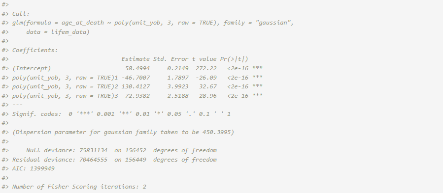
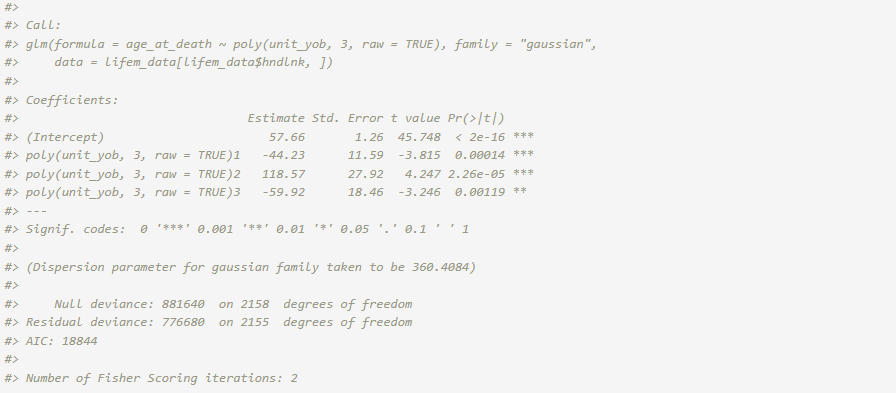
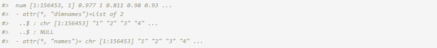

# Longevity Analysis with LIFE-M Data

[](https://colab.research.google.com/github/postlink-group/postlink/blob/main/notebooks/lifem_regression.ipynb)

### **1. Linked Data Set: [LIFE-M](https://life-m.org/) Project**

The LIFE-M (Longitudinal Intergenerational Family Electronic
Micro-Database) project is multi-generational data from the 20th century
that was gathered from several data sources including vital records and
decennial censuses. We examine the relationship between age at death and
year of birth using linked birth and death certificates on individuals
in Ohio (Slawski et al. ([2024](#ref-slawski2024general))). The source
of the death certificates and their collection periods influence the
trend in age at death over the years of birth. We focus on birth cohorts
where average longevity tends to increase. The linkage of certificate
records for LIFE-M was generated in two distinct ways. A fraction of
certificates was randomly sampled to be “hand-linked at some level”.
These are high quality links that were manually established by trained
research assistants. The remaining records were “purely machine-linked”
based on predictive modeling methods (automated probabilistic record
linkage without clerical review) (Bailey et al.
([2022](#ref-LifeMcit))).

The LIFE-M data set of interest contains records of linked data on
156,453 individuals from Ohio who were born between 1883 and 1906. Of
these records, 2,159 were hand-linked (\sim 1.4% of the records) while
the remaining were purely machine-linked. Although the purely
machine-linked records are more inclined to have mismatch errors, the
records with mismatched data are unknown. The LIFE-M team reports that
the expected mismatch rate among machine-linked records is approximately
5%. Records for the first 5 individuals in the linked data set
(`lifem_data`) are displayed below. Each line represents a distinct
individual.

``` r
url <- "https://github.com/postlink-group/postlink/releases/download/v0.1.0/lifem.rds"
lifem_data <- readRDS(url(url, "rb"))

head(lifem_data, n = 5) # 156,453 records w/ 6 variables
```


The age at death (in years) `age_at_death` is the response variable
(Y\_{A}) and the year of birth (rescaled to the unit interval for
analysis) `unit_yob` is used as a predictor variable (X\_{B}). We assume
a Gaussian regression model for the predictor-response relationship and
use a cubic polynomial to describe the non-linear relationship observed
for the birth cohorts.

In the following sections, we walk through the overall workflow for the
secondary analysis of the LIFE-M data set using an adjustment method for
mismatch errors. For reference, alternative approaches using standard
[`stats::glm()`](https://rdrr.io/r/stats/glm.html) function in R are
included in comparison.

*Note*: *The* **postlink** *package includes demo data based on this
full data set. For an interactive version of this article using the demo
data, please refer to the Colab notebook linked above.*

### **2. Naive Approach**

The Gaussian regression model that does not adjust for possible linkage
errors can be estimated using the standard
[`lm()`](https://rdrr.io/r/stats/lm.html) or
[`glm()`](https://rdrr.io/r/stats/glm.html) function.

``` r
fit_naive <- glm(age_at_death ~ poly(unit_yob, 3, raw = TRUE),
              data = lifem_data, family = "gaussian")
summary(fit_naive)
```



### **3. Hand-Linked Only Approach**

Alternatively, the analysis could be limited to the records that were
hand-linked. However, this procedure discards the majority of the linked
data and suffers from significant loss of power.

``` r
fit_hl <- glm(age_at_death ~ poly(unit_yob, 3, raw = TRUE), 
              data = lifem_data[lifem_data$hndlnk,], family = "gaussian")
summary(fit_hl)
```



### **4. Adjustment Approach**

Instead, the Gaussian regression model can be fit according to the
framework in Slawski et al. ([2024](#ref-slawski2024general)). This
method uses the entire linked data but adjusts for potential mismatch
errors. Among the existing options, we focus on this PLDA method based
on information present on the underlying record linkage process: the
linkage type (`hndlnk`), first and last name commonness scores (`commf`
and `comml`), and overall expected mismatch rate (i.e., not available
per record). We assume that records which were hand linked at some level
(`hndlnk` is `TRUE`) are correct matches. For the other records, the
correct match indicator (C) is considered unknown and modelled via
logistic regression with first and last name commonness scores
considered predictors (\mathbf{Z}). These scores are readily accessible
and relevant to match status since names were identifiers primarily used
to machine link certificates by the LIFE-M team. Scores range from zero
(least common) to one (most common). They were calculated as the ratio
between the log count of the name in the 1940 Census and the log count
of the most frequently used name in the 1940 Census. Furthermore, the
expected mismatch rate of 5% is incorporated on the logit scale. For
mismatched records, we assume the marginal distribution of the age at
death follows a Gaussian distribution and estimate the parameters using
the full data.

We postulate a two-component mixture model for l = 1, \dots, 156453:

\begin{aligned} &\hspace{3ex} Y\_{l}\| X_l, \\C\_{l}=1\\ \sim
N(\beta_0 + \beta_1 X_l + \beta_2 X_l^2 + \beta_3 X_l^3, \sigma^2) \\
&\hspace{3ex} Y\_{l}, \\C\_{l}=0\\ \sim N(\mu, \tau^2) \\ &\hspace{3ex}
C_l\| \texttt{commf}\_l, \texttt{comml}\_l \sim \text{Bernoulli}\Big(
\frac{\exp(\gamma_0 + \gamma_1 \texttt{commf}\_l + \gamma_2
\texttt{comml}\_l)}{1+\exp(\gamma_0 + \gamma_1 \texttt{commf}\_l +
\gamma_2 \texttt{comml}\_l)}\Big) \end{aligned}

In the estimation procedure, we can restrict the estimates to ensure
that the mismatch rate is smaller than 5%,

\begin{aligned} &\hspace{3ex} C_l = 1 \text{ for hand-linked at some
level records} \\ &\hspace{3ex} -\frac{1}{n}\sum\_{l=1}^n
\mathbf{Z}\_l^T \boldsymbol{\gamma} \leq \text{logit}(0.05)
\end{aligned}

There are two types of data that we should consider. The first type of
data is the outcome and covariates of interest. The second type of data
include information about the linkage, such as overall rate of false
positives, indicators for units that are certain to be true links, and
algorithm generated likelihood of links or measures used during the
linking process. To handle these two types of data components, we define
a linkage quality structure, and use that linkage quality information in
the estimation and inference algorithm.

To adjust for potential mismatch errors during secondary analysis, we
can use **postlink** as follows.

``` r
library(postlink) # v0.1.0
```

**I. Adjustment Specification**: We first instantiate an *Adjustment*
object with information on the linkage quality using the available
paradata. The object includes a `safe.matches` argument, which designate
certain units as matched without errors. We assume hand-linked records
(`hndlnk`) are correct matches. For records that we are not certain, the
latent correct-match indicator is modeled using logistic regression that
include first and last name commonness scores (`commf` and `comml`) as
predictors. Lastly, we can include the overall mismatch rate (5%) that
is used as a constraint for the Expectation-Maximization (EM) algorithm
used in the framework (Slawski et al.
([2024](#ref-slawski2024general))).

``` r
adj_lifem <- adjMixture(
    linked.data = lifem_data,
    m.formula = ~ commf + comml,           
    m.rate = 0.05,                               
    safe.matches = hndlnk                
  )
print(adj_lifem)
```


**II. Estimation and Inference**. We pass the resulting *Adjustment*
object to the
[`plglm()`](https://postlink-group.github.io/postlink/reference/plglm.md)
wrapper. This merges the paradata with the formula for the model of
specific interest to implement the linkage errors adjusted estimates,

``` r
fit_adj <- plglm(
    age_at_death ~ poly(unit_yob, 3, raw = TRUE), family = "gaussian",
    adjustment = adj_lifem
  )
summary(fit_adj)
```


The average correct match rate refers to the mean of the posterior
correct match probabilities for all of the records. The probability for
each record is accessible through the `fit` object in the `match.prob`
vector. For safe matches, the probability is set to 1.

``` r
str(fit_adj$match.prob)
```



For the model of primary interest, the
[`confint()`](https://rdrr.io/r/stats/confint.html) function provides
confidence intervals for the coefficients. The default confidence level
is 0.95.

``` r
confint(fit_adj)
```


The [`predict()`](https://rdrr.io/r/stats/predict.html) function
computes the predicted ages at death for the 1883 - 1906 birth cohorts
along with point-wise standard errors and 95\\ confidence intervals. The
predictions type is set to “link” (i.e., linear predictors) by default.

``` r
predictions <- predict(fit_adj, se.fit = TRUE, interval = "confidence")
str(predictions)
```


### **5. Comparison**

The predictions after adjustment for potential mismatch errors are
visualized in Figure 1, along with the naive and hand-linked only
analysis results.


Figure 1. Predicted ages at death (solid lines) and the proportion of
LIFE-M individuals (bottom) from 1883-1906. Point-wise 95% confidence
intervals are depicted by dashes for the hand-linked only approach and
shaded ribbons for the naive and adjusted approaches.

  

While the hand-linked only approach is based on matches assumed to be
correct, its results are characterized by relatively large prediction
intervals. The naive approach uses the entire linked data but assumes
perfect record linkage. Although the 95% point-wise confidence intervals
are narrower, the predictions diverge from those of the hand-linked only
approach from around 1897 and fall below its point-wise confidence
interval after 1904. Adjustment yields estimates of comparable scale to
the other two approaches. It uses the entire linked data and provides
results with lower uncertainty. Also, for the later cohorts, the results
align more with those expected from correct matches.

## **References**

Bailey, M., P. Z. Lin, A. R. Shaqir Mohammed, P. Mohnen, J. Murray, M.
Zhang, and A. Prettyman. 2022. “LIFE-M: The Longitudinal,
Intergenerational Family Electronic Micro-Database.” Inter-university
Consortium for Political and Social Research (ICPSR).

Slawski, Martin, Brady T West, Priyanjali Bukke, Zhenbang Wang, Guoqing
Diao, and Emanuel Ben-David. 2024. “A General Framework for Regression
with Mismatched Data Based on Mixture Modelling.” *Journal of the Royal
Statistical Society Series A: Statistics in Society*, qnae083.
