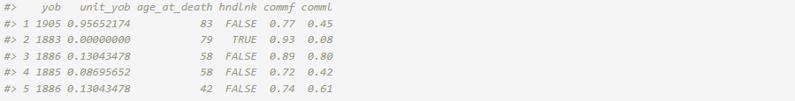
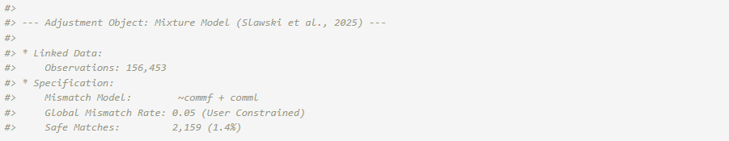
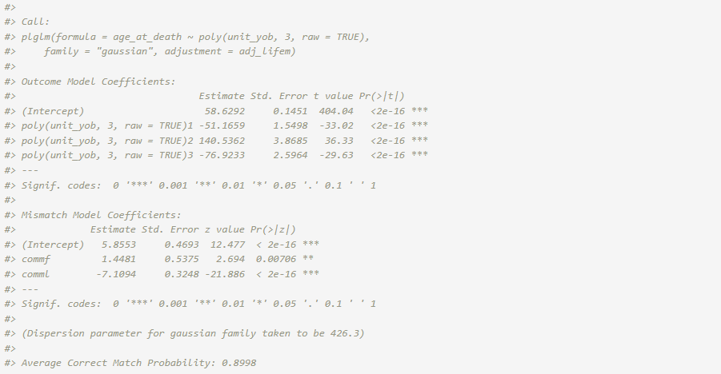
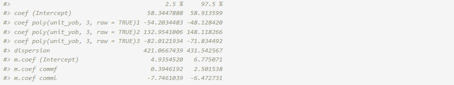
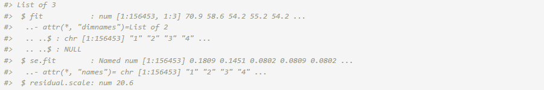

```{r setup, include=FALSE}
# This chunk ensures the vignette is static and won't run during package build
knitr::opts_chunk$set(
  collapse = TRUE,
  comment = "#>",
  eval = FALSE 
)
```

<a target="_blank" href="https://colab.research.google.com/github/postlink-group/postlink/blob/main/notebooks/lifem_regression.ipynb">
  
</a>

## **1. Linked Data Set: [LIFE-M](https://life-m.org/) Project**

The LIFE-M (Longitudinal Intergenerational Family Electronic Micro-Database) project is multi-generational data from the 20th century that was gathered from several data sources including vital records and decennial censuses. We examine the relationship between age at death and year of birth using linked birth and death certificates on individuals in Ohio (@slawski2024general). The source of the death certificates and their collection periods influence the trend in age at death over the years of birth. We focus on birth cohorts where average longevity tends to increase. The linkage of certificate records for LIFE-M was generated in two distinct ways. A fraction of certificates was randomly sampled to be "hand-linked at some level". These are high quality links that were manually established by trained research assistants. The remaining records were “purely machine-linked” based on predictive modeling methods (automated probabilistic record linkage without clerical review) (@LifeMcit).

The LIFE-M data set of interest contains records of linked data on 156,453 individuals from Ohio who were born between 1883 and 1906. Of these records, 2,159 were hand-linked ($\sim$ 1.4% of the records) while the remaining were purely machine-linked. Although the purely machine-linked records are more inclined to have mismatch errors, the records with mismatched data are unknown. The LIFE-M team reports that the expected mismatch rate among machine-linked records is approximately 5%. Records for the first 5 individuals in the linked data set (`lifem_data`) are displayed below. Each line represents a distinct individual.

```{r}
url <- "https://github.com/postlink-group/postlink/releases/download/v0.1.0/lifem.rds"
lifem_data <- readRDS(url(url, "rb"))

head(lifem_data, n = 5) # 156,453 records w/ 6 variables
```



The age at death (in years) `age_at_death` is the response variable ($Y_{A}$) and the year of birth (rescaled to the unit interval for analysis) `unit_yob` is used as a predictor variable ($X_{B}$). We assume a Gaussian regression model for the predictor-response relationship and use a cubic polynomial to describe the non-linear relationship observed for the birth cohorts.

In the following sections, we walk through the overall workflow for the secondary analysis of the LIFE-M data set using an adjustment method for mismatch errors. For reference, alternative approaches using standard `stats::glm()` function in R are included in comparison.

*Note*: *The* **postlink** *package includes demo data based on this full data set. For an interactive version of this article using the demo data, please refer to the Colab notebook linked above.*

## **2. Naive Approach**

The Gaussian regression model that does not adjust for possible linkage errors can be estimated using the standard `lm()` or `glm()` function.

```{r}
fit_naive <- glm(age_at_death ~ poly(unit_yob, 3, raw = TRUE),
              data = lifem_data, family = "gaussian")
summary(fit_naive)
```


## **3. Hand-Linked Only Approach**

Alternatively, the analysis could be limited to the records that were hand-linked. However, this procedure discards the majority of the linked data and suffers from significant loss of power.

```{r}
fit_hl <- glm(age_at_death ~ poly(unit_yob, 3, raw = TRUE), 
              data = lifem_data[lifem_data$hndlnk,], family = "gaussian")
summary(fit_hl)
```


## **4. Adjustment Approach**

Instead, the Gaussian regression model can be fit according to the framework in @slawski2024general. This method uses the entire linked data but adjusts for potential mismatch errors. Among the existing options, we focus on this PLDA method based on information present on the underlying record linkage process: the linkage type (`hndlnk`), first and last name commonness scores (`commf` and `comml`), and overall expected mismatch rate (i.e., not available per record). We assume that records which were hand linked at some level (`hndlnk` is `TRUE`) are correct matches. For the other records, the correct match indicator ($C$) is considered unknown and modelled via logistic regression with first and last name commonness scores considered predictors ($\mathbf{Z}$). These scores are readily accessible and relevant to match status since names were identifiers primarily used to machine link certificates by the LIFE-M team. Scores range from zero (least common) to one (most common). They were calculated as the ratio between the log count of the name in the 1940 Census and the log count of the most frequently used name in the 1940 Census. Furthermore, the expected mismatch rate of 5% is incorporated on the logit scale. For mismatched records, we assume the marginal distribution of the age at death follows a Gaussian distribution and estimate the parameters using the full data.

We postulate a two-component mixture model for $l = 1, \dots, 156453$:

$$
\begin{aligned}
&\hspace{3ex} Y_{l}| X_l, \{C_{l}=1\} \sim N(\beta_0 + \beta_1 X_l + \beta_2 X_l^2 + \beta_3 X_l^3, \sigma^2) \\
&\hspace{3ex} Y_{l}, \{C_{l}=0\} \sim N(\mu, \tau^2) \\
&\hspace{3ex} C_l| \texttt{commf}_l, \texttt{comml}_l \sim \text{Bernoulli}\Big( \frac{\exp(\gamma_0 + \gamma_1 \texttt{commf}_l + \gamma_2 \texttt{comml}_l)}{1+\exp(\gamma_0 + \gamma_1 \texttt{commf}_l + \gamma_2 \texttt{comml}_l)}\Big)
\end{aligned}
$$

In the estimation procedure, we can restrict the estimates to ensure that the mismatch rate is smaller than 5%,

$$
\begin{aligned}
&\hspace{3ex} C_l = 1 \text{ for hand-linked at some level records} \\
&\hspace{3ex} -\frac{1}{n}\sum_{l=1}^n \mathbf{Z}_l^T \boldsymbol{\gamma} \leq \text{logit}(0.05)
\end{aligned}
$$

There are two types of data that we should consider. The first type of data is the outcome and covariates of interest. The second type of data include information about the linkage, such as overall rate of false positives, indicators for units that are certain to be true links, and algorithm generated likelihood of links or measures used during the linking process. To handle these two types of data components, we define a linkage quality structure, and use that linkage quality information in the estimation and inference algorithm.

To adjust for potential mismatch errors during secondary analysis, we can use **postlink** as follows.

```{r}
library(postlink) # v0.1.0
```

**I. Adjustment Specification**: We first instantiate an *Adjustment* object with information on the linkage quality using the available paradata. The object includes a `safe.matches` argument, which designate certain units as matched without errors. We assume hand-linked records (`hndlnk`) are correct matches. For records that we are not certain, the latent correct-match indicator is modeled using logistic regression that include first and last name commonness scores (`commf` and `comml`) as predictors. Lastly, we can include the overall mismatch rate (5%) that is used as a constraint for the Expectation-Maximization (EM) algorithm used in the framework (@slawski2024general).

```{r}
adj_lifem <- adjMixture(
    linked.data = lifem_data,
    m.formula = ~ commf + comml,           
    m.rate = 0.05,                               
    safe.matches = hndlnk                
  )
print(adj_lifem)
```



**II. Estimation and Inference**. We pass the resulting *Adjustment* object to the `plglm()` wrapper. This merges the paradata with the formula for the model of specific interest to implement the linkage errors adjusted estimates,

```{r}
fit_adj <- plglm(
    age_at_death ~ poly(unit_yob, 3, raw = TRUE), family = "gaussian",
    adjustment = adj_lifem
  )
summary(fit_adj)
```



The average correct match rate refers to the mean of the posterior correct match probabilities for all of the records. The probability for each record is accessible through the `fit` object in the `match.prob` vector. For safe matches, the probability is set to 1.

```{r}
str(fit_adj$match.prob)
```


For the model of primary interest, the `confint()` function provides confidence intervals for the coefficients. The default confidence level is $0.95$.

```{r}
confint(fit_adj)
```



The `predict()` function computes the predicted ages at death for the 1883 - 1906 birth cohorts along with point-wise standard errors and $95\%$ confidence intervals. The predictions type is set to "link" (i.e., linear predictors) by default.

```{r}
predictions <- predict(fit_adj, se.fit = TRUE, interval = "confidence")
str(predictions)
```



## **5. Comparison**

The predictions after adjustment for potential mismatch errors are visualized in Figure 1, along with the naive and hand-linked only analysis results.

```{r fig.height=6, fig.width=10, include=FALSE}
library(ggplot2) # v4.0.2
library(dplyr) # v1.1.4
library(patchwork) # v1.3.2

# 1. Generate predictions and standard errors
pred_adj <- predict(fit_adj, se.fit = TRUE)
pred_naive <- predict(fit_naive, se.fit = TRUE)
pred_hl <- predict(fit_hl, se.fit = TRUE)

# Map unit_yob (0 to 1) back to actual birth years (1883 to 1906)
actual_years <- 1883 + (lifem_data$unit_yob * 23)

# Helper function to create plotting dataframes with calculated 95% CIs
create_plot_df <- function(pred_obj, years, model_name) {
  data.frame(
    Year = years,
    Fit = pred_obj$fit,
    Lwr = pred_obj$fit - (1.96 * pred_obj$se.fit),
    Upr = pred_obj$fit + (1.96 * pred_obj$se.fit),
    Model = model_name
  ) %>% arrange(Year)
}

# 2. Structure data for plotting
df_adj <- create_plot_df(pred_adj, actual_years, 
                         "Adjusted (n = 156,453 individuals)")
df_naive <- create_plot_df(pred_naive, actual_years, "Naive (n = 156,453)")
df_hl <- create_plot_df(pred_hl, actual_years[lifem_data$hndlnk], 
                        "Hand-linked only (n = 2,159)")

# Combine datasets for ribbons and lines
df_ribbon <- bind_rows(df_adj, df_naive)
df_all <- bind_rows(df_adj, df_naive, df_hl)

line_colors <- c(
  "Adjusted (n = 156,453 individuals)" = "#2986cc",
  "Hand-linked only (n = 2,159)"       = "black",
  "Naive (n = 156,453)"                = "#d988b3"
)

# 3. Build top plot (Predictions)
p_top <- ggplot() +
  geom_ribbon(data = df_ribbon, aes(x = Year, ymin = Lwr, ymax = Upr, 
                                    fill = Model), alpha = 0.25) +
  geom_line(data = df_hl, aes(x = Year, y = Lwr), linetype = "dashed", 
            color = "black", linewidth = 0.5) +
  geom_line(data = df_hl, aes(x = Year, y = Upr), linetype = "dashed", 
            color = "black", linewidth = 0.5) +
  geom_line(data = df_all, aes(x = Year, y = Fit, color = Model), linewidth = 1) +
  scale_color_manual(values = line_colors) +
  scale_fill_manual(values = line_colors, guide = "none") +
  scale_x_continuous(breaks = seq(1882, 1906, by = 2)) +
  scale_y_continuous(breaks = seq(50, 85, by = 5)) +
  labs(y = "Age at Death", x = NULL) +
  theme_classic(base_size = 14) +
  theme(
    legend.position = c(0.02, 0.98),
    legend.justification = c(0, 1),
    legend.title = element_blank(),
    legend.background = element_rect(fill = "transparent", color = NA),
    axis.text.x = element_blank(),
    axis.ticks.x = element_blank(),
    axis.line.x = element_blank()
  )

# 4. Build bottom plot (Density)
p_bottom <- ggplot(data.frame(Year = actual_years), aes(x = Year)) +
  geom_density(fill = "lightgray", color = "black", alpha = 0.8) +
  labs(x = "Year of Birth", y = "Proportion") +
  scale_x_continuous(breaks = seq(1882, 1906, by = 2)) +
  scale_y_continuous(
    breaks = c(0, 0.06), 
    labels = c("0.00", "0.06")
  ) +
  coord_cartesian(ylim = c(0, 0.075)) +
  theme_classic(base_size = 14) +
  theme(panel.background = element_blank())

# 5. Combine and render with patchwork
p_top / p_bottom + plot_layout(heights = c(5, 1))
```


{width=450px style="display: block; margin: 0 auto;"}

<br>

While the hand-linked only approach is based on matches assumed to be correct, its results are characterized by relatively large prediction intervals. The naive approach uses the entire linked data but assumes perfect record linkage. Although the 95% point-wise confidence intervals are narrower, the predictions diverge from those of the hand-linked only approach from around 1897 and fall below its point-wise confidence interval after 1904. Adjustment yields estimates of comparable scale to the other two approaches. It uses the entire linked data and provides results with lower uncertainty. Also, for the later cohorts, the results align more with those expected from correct matches.

# **References**
