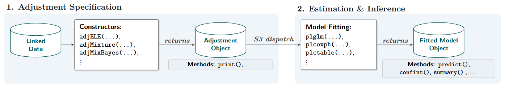
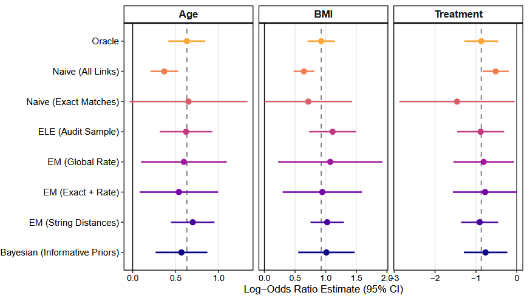

```{r setup, include=FALSE}
knitr::opts_chunk$set(
  collapse = TRUE,
  comment = "#>"
)
```

<style>
body {
  text-align: justify;
}

/* Target only images inside the main article body to be full width */
.section.level2 img, .section.level3 img {
  display: block;
  margin-left: auto;
  margin-right: auto;
  width: 100%;
  height: auto;
}

/* Force the Table of Contents to full width */
#TOC {
  max-width: 100% !important;
  width: 100%;
}

/* Hide the hex package sticker by pkgdown in the article header */
.page-header img, img.logo, .pkgdown-logo {
  display: none !important;
}

/* Hide the 3rd level (###) sub-sections in the pkgdown right-sidebar TOC */
#toc ul ul, .pkgdown-toc ul ul, nav[data-toggle="toc"] ul ul {
  display: none !important;
}
</style>

## Abstract

The advent of the digital age has reshaped the processes by which data
are collected, shared, and analyzed. An important trend within this
landscape is the integration of disparate data sources, often collected
independently and stored in isolation. Consequently, methods for data
integration are needed to realize the value of all existing data sources
in combination. Among these methods, Record Linkage (RL) plays a pivotal
role by enabling the connection of individual records across multiple
data sets. RL spans a wide array of contemporary applications, including
the linkage of survey data, administrative and electronic health
records, as well as historical censuses and vital records. Open-source
software to facilitate RL when records are linked using
quasi-identifiers is widely available. However, software for analyzing
linked files that accounts for the uncertainty and error-prone nature of
RL is lacking. Specifically, there is lack of software in the secondary
analysis setting in which RL and downstream analysis are conducted
separately. We describe `postlink`, an R package dedicated to analyzing
data integrated using error-prone record linkage. A central feature of
the package is its extensible, formula-based architecture, offering a
suite of post-linkage counterparts to R's standard modeling toolkit.

------------------------------------------------------------------------

## 1. Introduction {#sec-intro}

Information integration across multiple data sources is increasingly
being applied in various scientific and policy contexts. Record linkage
(RL) and privacy preserving record linkage (PPRL) refer to a set of
tools that identify records on the same entity across data sources. In
the absence of unique identifying information, RL and PPRL are prone to
errors. Records from different entities may be incorrectly linked (false
matches), and records that correspond to the same entity may be missed
(false non-matches). These errors can result in biased and inaccurate
estimates [@neter65]. To obtain statistically valid estimates, analyses
of linked datasets should adjust for these errors [@chambersdasilva2020;
@wangreview; @kamatreview]. However, because of privacy considerations,
the original datasets and the information pertinent to adjustment may be
limited or absent. This challenge is referred to as *secondary
analysis*, in which the linkage is performed by one organization and the
analyses of the linked data-sets are implemented by other organizations.
The National Institute on Aging (NIA) LINKAGE project, which enables
access to NIA-funded study data linked to administrative records from
the Centers for Medicare & Medicaid Services, is a prominent example of
such a setting [@NIA]. We use the term *post-linkage data analysis
(PLDA)* to describe statistical analyses of data that have been
generated through record linkage or privacy preserving record linkage.

Multiple R packages have been developed to link records in the absence
of unique identifiers. Some of these applications are based on the
Fellegi-Sunter model [@Fellegi1969], `RecordLinkage` [@recordlinkage],
`fastLink` [@fastlink]. More recently, Bayesian record linkage packages
were developed, `bstrl` [@bstrl], `BRL` [@Sadinle2017] and `blink`
[@blink]. In addition, privacy preserving record linkage package is
available through `PPRL` [@PPRL]. Python record linkage tools such as
`Splink` [@splink], `recordlinkage` [@recordlinkagep], `dedupe`
[@dedupe], `gfs_sampler` [@gfs], and `anonlink` [@Anonlink] have been
developed to offer flexible and scalable linkage solutions.

After the linkage process is complete, it is imperative to evaluate the
quality of the linkage and address possible linkage errors in downstream
analysis. The `ER-Evaluation` package in Python [@er-evaluation] has
been developed to assess linkage quality using benchmark data. However,
dedicated tools to conduct statistical analyses that account for
potential linkage errors are absent. A common statistical tool to
estimate the relationship between an outcome and a set of covariates are
linear and generalized linear models. These models are efficiently
implemented with the `lm()` and `glm()` commands in R [@R2025]. Applying
these methods directly to linked datasets assumes that all records are
correctly linked, with no erroneous matches. Although statistical
methods to adjust for linkage errors have been proposed [@kamatreview],
the corresponding software is often not readily accessible. This poses a
barrier to the adoption and application of these methods in practice.
[@chambers2009regression] provides R functions to adjust for linkage
errors within the regression framework. These methods assume that the
probability of a mismatch is constant across records within defined
subgroups (i.e., exchangeable linkage errors). However, the available R
functions are largely limited to estimating equations for linear and
logistic regressions, and are geared toward simulation and
methodological illustration. As such, they are not well suited for
routine use by analysts or subject-matter experts and may be
computationally inefficient.

We have developed an R package, `postlink` [@postlink], that provides a
cohesive and user-friendly implementation of PLDA methods across a range
of settings and input types. The package is available from the
Comprehensive R Archive Network (CRAN) at
<https://CRAN.R-project.org/package=postlink>, and is implemented using
a common modeling interface while adjusting for falsely linked records.
The `postlink` package focuses on methods for secondary analysis. In
primary analysis settings, where individual files are accessible,
methods that jointly perform record linkage and analysis with direct
propagation of uncertainty are more appropriate.

The `postlink` R package consolidates three foundational frameworks for
post-linkage data analysis. First, the software implements
expectation-maximization (EM) based mixture modeling, which absorbs the
precursor package `pldamixture` [@pldamixture] and facilitates
contingency table analysis based on methods developed in
@slawski2024general. Second, the package incorporates a Bayesian mixture
modeling approach proposed in @gutmanmixture. This approach enables the
estimation of model parameters after adjustments for linkage errors, as
well as using multiple imputations of the latent match status (correctly
vs. incorrectly linked records). The imputed match status can then be
used to fit post-linkage models not originally specified, using standard
multiple imputation combining rules [@Rubin1996]. Third, the package
integrates bias-adjusted estimating equations following the work of
@chambers2009regression for generalized linear models and @vo2024cox for
Cox proportional hazards regression. Within `postlink`, the methods in
@chambers2009regression are extended to encompass the Poisson and Gamma
regression models. In addition, our implementation improves the
scalability of these methods for larger datasets and their accessibility
for analysts.

Subsequent sections of the paper are structured as follows. [Section
2](#sec-models) provides an overview of the `postlink` package. [Section
3](#sec-methods) details the three adjustment methods implemented in the
R package. [Section 4](#sec-illustrations) illustrates the usage of the
package with a case study. We conclude and discuss future directions in
[Section 5](#sec-summary). Further demonstrations and details regarding
the package functionality are available on the `postlink` website at
<https://postlink-group.github.io/postlink/>. The long-term goal of
`postlink` is to progressively expand its functionality to support a
broad range of linkage and post-linkage analysis scenarios.

## 2. The postlink Architecture {#sec-models}

The `postlink` package provides an extensible computational framework
for post-linkage data analysis (PLDA). Given the diversity in record
linkage pipelines—both in underlying data structures and in the amount
of linkage information available—the software is built using a modular,
object-oriented R architecture. As illustrated in Figure 1, the workflow
leverages S3 method dispatch to decouple the specification of linkage
uncertainty from the substantive statistical modeling. This separation
serves three primary software design objectives: (1) providing a unified
interface for diverse post-linkage scenarios; (2) allowing practitioners
to propagate linkage uncertainty using standard regression paradigms;
and (3) separating the internal mechanics of the package from its public
application programming interface (API) to facilitate extensibility.

The user workflow is consequently partitioned into two phases: 1)
Adjustment Specification and 2) Estimation & Inference. In the first
phase, the focus is on formulating the nature of the data and the
linkage errors. The second phase focuses on the scientific questions
that need to be addressed using the data.

{fig-align="center" width="690"}

*Figure 1: Schematic of the typical two-phase `postlink` workflow,
illustrating the decoupling of the adjustment specification from the
outcome model fitting.*

### Phase 1: Adjustment Specification

In the first phase, the analyst defines the linked dataset and the
available information about the linkage process using a constructor
function. These functions, prefixed with `adj`, correspond to different
frameworks (e.g., weighting-based methods or mixture modeling
approaches). [Section 3](#sec-methods) describes the specific adjustment
methods and linkage error scenarios currently supported. The
constructors perform an initial validation layer to check for coherence
between the data structure and the assumptions of the chosen adjustment
methodology. Upon successful validation, the constructor returns a
structured S3 `Adjustment` object. To accommodate large-scale data, this
object is engineered as a lightweight container. This construction
minimizes memory overhead by retaining essential metadata and accessing
the underlying data by reference to avoid duplication. The `Adjustment`
object also implements context-specific methods for standard generics
(e.g., `print()`, `plot()`), enabling diagnostic inspection of the
linkage assumptions before model fitting.

### Phase 2: Estimation and Inference

The second phase handles model fitting through a suite of wrapper
functions designed to mirror standard R regression interfaces. The
current core functions include `plglm()` for generalized linear models,
`plcoxph()` for Cox proportional hazards, `plsurvreg()` for parametric
survival models, and `plctable()` for contingency table analyses. Using
S3 dispatch, these wrappers automatically retrieve the encapsulated
specifications from the provided `Adjustment` object and perform the
corresponding internal inference routine. This design allows analysts to
use the familiar formula-based syntax of core R functions (e.g.,
`stats::glm()`, `survival::coxph()`), while the package manages the
underlying computational complexity. The resulting fitted model objects
integrate with the R ecosystem, supporting standard post-modeling
generics such as `summary()`, `confint()`, `vcov()`, and `predict()`.
For Bayesian adjustments, multiple imputation pooling is supported with
a generic `mi_with()` function.

### Dual-Access Interface

Complementing the two-phase workflow, the underlying computational
routines are also available (e.g., `glmELE()`, `coxphMixture()`,
`survregMixBayes()`). The S3 framework can be bypassed to invoke these
routines directly, a capability advantageous for performance-critical
tasks, such as large-scale simulation studies, or for developers
prototyping new adjustment algorithms. This decoupling also ensures that
emerging PLDA methodologies can be integrated without altering the
established modeling syntax.

## 3. Adjustment Methods for Secondary Analysis {#sec-methods}

We describe the theoretical foundation for the secondary analysis
methods that are supported in `postlink`. We assume that the linked
dataset, denoted as $LD$, comprises of $n$ record pairs. For entity
$i \in \{1, \dots, n\}$, we observe a single outcome variable $Y_{Ai}$
and a set of covariates $\mathbf{X}_{Ai}$ originally recorded in data
source A, alongside a set of covariates $\mathbf{X}_{Bi}$ originally
recorded in data source B. Formally, the linked data is defined as
$LD = \left(\mathbf{X}_{B}, \mathbf{Y}_A, \mathbf{X}_A \right)$, where
$\mathbf{X}_{B} = \{\mathbf{X}_{B1},\ldots,\mathbf{X}_{Bn}\}$,
$\mathbf{Y}_{A} = \{Y_{A1},\ldots,Y_{An}\}$ and
$\mathbf{X}_{A} = \{\mathbf{X}_{A1},\ldots,\mathbf{X}_{An}\}$. Suppose
that an analyst utilizes dataset $LD$ to estimate the conditional
distribution
$p(Y_{Ai} \mid \mathbf{X}_{Ai},\mathbf{X}_{Bi};\boldsymbol{\beta})$,
where $\boldsymbol{\beta}$ is a set of unknown parameters governing this
distribution. Because $LD$ is formed by merging two separate data
sources without unique identifiers, it contains the observed paired
outcome $Y_{Ai}^*$, which may differ from the true outcome $Y_{Ai}$
because of linkage errors ($Y_{Ai}^* \neq Y_{Ai}$). As a result, $LD$
includes both true and false links, and only limited information on
overall linkage quality may be available (e.g., estimated mismatch rates
within blocks).

When the original data sources are of the same size and they both
represent the same entities, the observed vector $\mathbf{Y}_{A}^*$ is a
permuted version of true vector $\mathbf{Y}_{A}$, such that
$\mathbf{Y}_{A}^* = \Delta\mathbf{Y}_{A}$, where $\Delta$ is an
$n\times n$ permutation matrix with exactly one entry equal to one in
each row and column. When there are no errors in the linkage, $\Delta$
is the identity matrix and $\mathbf{Y}_{A}^*=\mathbf{Y}_{A}$.

This notation cannot be utilized when the dataset includes some records
that represent the same entities, and some records that do not. To
address this limitation, we rely on an indicator variable $C_i$ with
$C_i=1$ for correct matches, i.e., $Y_{Ai}^*=Y_{Ai}$, and $C_i=0$
otherwise, $1 \leq i \leq n$.

A naive estimator $\widehat{\boldsymbol{\beta}}_N$ of the parameter
$\boldsymbol{\beta}$ is obtained by regressing $\mathbf{Y}_A^*$ on
$\mathbf{X} = [\mathbf{X}_A \; \mathbf{X}_B]$. This estimator is
typically biased when $\mathbf{Y}^*_{A} \neq  \mathbf{Y}_{A}$ [@neter65;
@wangreview; @kamatreview]. To mitigate this bias, `postlink` provides
three distinct adjustment frameworks, which are accessible through the
package's two-phase `adj*()` and `pl*()` architecture. Table 1 provides
an overview of these frameworks, their constructor functions, and
statistical modeling they currently support.

*Table 1: An overview of three PLDA frameworks implemented in
`postlink`*

| Framework | Constructor | Primary Use Case | Supported Models |
|:-----------------|:-----------------|:-----------------|:-----------------|
| **Weighting** | `adjELE()` | When block-level mismatch rates are given (e.g., from audit samples). | GLMs, CoxPH |
| **Mixture Modeling** | `adjMixture()` | When continuous or categorical paradata on linkage quality (e.g., string distances) are available. | GLMs, CoxPH, Contingency Tables |
| **Bayesian Mixture** | `adjMixBayes()` | When exploring multiple scientific models or to incorporate prior knowledge. | GLM, Parametric Survival |

### 3.1 Weighting

The first approach relies on weighting the estimating equations to
correct for mismatch bias. Suppose that $\mathbf{X} = \mathbf{X}_B$, so
that there are no covariates residing with the outcome in data source A.
In addition, dataset $LD$ is partitioned into $Q$ blocks, where block
$q \in \{1,\dots, Q\}$ is of size $n_q$, and $n = \sum_{q=1}^{Q} n_q$.
Block partitioning is commonly used to reduce the computational
complexity of linkage algorithms. Blocks are formed by requiring exact
agreement on categorical linking variables across datasets, such that
all individuals within a block share the same values on these variables.
Let $\mathbf{Y}^{*}_{Aq}$, $\mathbf{X}_{Bq}$ and $\Delta_q$ denote the
response variable, the matrix of covariates, and a binary matrix of
order $n_q$ in block $q$, respectively. Under the non-informative
linkage assumption [@chambers2009regression; @kamatreview], $\Delta_q$
is independent of $\mathbf{Y}_{Aq}$ given $\mathbf{X}_{Bq}$, which
implies that $$
E(\mathbf{Y}_{Aq}^* \mid \mathbf{X}_{Bq}) = E(\Delta_q \mid \mathbf{X}_{Bq}) E(\mathbf{Y}_{Aq} \mid \mathbf{X}_{Bq}) = E_q f_q(\boldsymbol{\beta}),
$$ where $E_q = E(\Delta_q \mid \mathbf{X}_{Bq})$, and
$f_q(\boldsymbol{\beta}) = E(\mathbf{Y}_{Aq} \mid \mathbf{X}_{Bq})$ is
the regression function under correctly linked data. When the data is
correctly linked, an estimating equation for $\boldsymbol{\beta}$ is of
the form $$
\sum_{q=1}^{Q} \mathbf{G}_q(\mathbf{X}_{Bq}, \boldsymbol{\beta}) \left\{\mathbf{Y}_{Aq}-f_q(\boldsymbol{\beta}) \right\}=0,
$$ where $\mathbf{G}_q(\mathbf{X}_{Bq}, \boldsymbol{\beta})$ is a
weighting matrix that is independent of $\mathbf{Y}_{Aq}$. However, we
only have access to $\mathbf{Y}^*_{Aq}$. Replacing $\mathbf{Y}_{Aq}$
with $\mathbf{Y}^*_{Aq}$ results in the naive estimator
$\widehat{\boldsymbol{\beta}}_N$. This estimator is biased when some of
the units are incorrectly linked [@chambers2009regression]. To correct
for the bias in $\widehat{\boldsymbol{\beta}}_N$, we modify the equation
to adjust for linkage errors, $$
\sum_{q} \mathbf{G}_q(\mathbf{X}_{Bq}, \boldsymbol{\beta}) \left\{ \mathbf{Y}^*_{Aq} - E_q f_q(\boldsymbol{\beta}) \right\} = 0. 
$$ @chambers2009regression constructed $E_q$ under the exchangeable
linkage error (ELE) model 
$$
[E_q]_{ij} =
\begin{cases}
\lambda_q, & \text{if record pair } (i,j) \text{ is a link},\\
\frac{1 - \lambda_q}{n_q - 1}, & \text{otherwise},
\end{cases}
$$
where $\lambda_q$ is the proportion of correct links in block $q$,
and it is either known to the analyst or estimated from audit samples.

The choice of $\mathbf{G}_q(\mathbf{X}_{Bq}, \boldsymbol{\beta})$ leads
to different estimators. For example, in linear regression,
$\mathbf{G}_q = \mathbf{X}_{Bq}^\top$ yields a ratio-type adjustment
estimator, which is similar to the one proposed by @scheurenwinkler93.
Setting $\mathbf{G}_q = \mathbf{X}_{Bq}^\top E_q$ results in the
estimator proposed by @lahirilarsen05. Setting
$\mathbf{G}_q = \mathbf{X}_{Bq}^\top E_q^\top (\boldsymbol{\Sigma}_q + \mathbf{V}_q)^{-1}$
leads to the best linear unbiased estimator (BLUE) of
$\boldsymbol{\beta}$, where
$\mathbf{V}_q = \mathrm{Var}(\Delta_q E(\mathbf{Y}_q \mid \mathbf{X}_{Bq}) \mid \mathbf{X}_{Bq})$
and $\boldsymbol{\Sigma}_q$ is a diagonal matrix containing the
observation-specific error variances,
$\sigma_i^2 = \mathrm{Var}(Y_i \mid \mathbf{X}_{Bi})$,
$1 \leq i \leq n$. Because the BLUE depends on unknown quantities, it
can be approximated using an iterative procedure in which these
quantities are replaced by successively refined estimates.

This suite of weighting methods has been extended to generalized linear
models [@chambers2009regression] and time-to-event models [@vo2024cox].
Corresponding sandwich-type variance estimators have also been derived
[@chambers2009regression].

In `postlink`, this procedure is implemented using the two-phase
workflow. First, the analyst specifies the ELE assumptions using the
`adjELE()` constructor:

```{r, eval=FALSE}
adjELE(
  linked.data,
  m.rate,          # Block-specific or global mismatch rates
  audit.size,      # Optional: Sample sizes for clerical review audit
  blocks,          # Vector defining the blocking structure
  weight.matrix    # Specifies the G_q matrix formulation
)
```

The `m.rate` argument supplies block-specific or global probabilities of
mismatch, $1-\lambda_q$. The `blocks` argument is an indicator for the
blocking structure, which can be omitted if no blocks are present. If
the mismatch rates are estimated from a clerical review, the
`audit.size` argument can be supplied to accordingly inflate the
variance estimation. The form of the weighting matrix can be specified
in `weight.matrix`, allowing the user to select between the ratio-type
adjustment (`"ratio"`), the Lahiri-Larsen estimator (`"LL"`), the best
linear unbiased estimator (`"BLUE"`), or `"all"` to compute all of them
simultaneously.

Once the adjustment object is validated and constructed, it is passed to
a standard modeling wrapper, such as `plglm()` for GLMs or `plcoxph()`
for survival analysis using Cox proportional hazard model:

```{r, eval=FALSE}
plglm(formula, family = "gaussian", adjustment, control, ...)

plcoxph(formula, adjustment, control, ...)
```

The parameter `formula` describes the relationship between
$\mathbf{Y}_q^*$ and $\mathbf{X}_{Bq}$, while the parameter `family`
describes the link function. These arguments correspond to the
regression mean function $f_q(\boldsymbol{\beta})$. The parameter
`family` is set to `"gaussian"` by default, but can take the values
`"binomial"`, `"poisson"`, or `"gamma"`. The `control` parameter allows
the user to specify starting values for the iterative algorithm used to
estimate $\boldsymbol{\beta}$. By default, the naive estimator is used
as the initial value for ratio-type and Lahiri–Larsen weight matrix
adjustments. For the BLUE weight matrix, the Lahiri–Larsen estimator
serves as the default starting value for estimating
$\boldsymbol{\beta}$.

The backend implementation differs from that of @chambers2009regression
primarily in how the expected estimating equation is handled. By relying
on vectorized operations for block-wise processing and analytically
simplifying $E_q M$ into a sum of column means and scalar constants, the
internal computational routine reduces the computational complexity from
$\mathcal{O}(n_q^2 d)$ down to $\mathcal{O}(n_q d)$, where $d$
represents the number of covariates in the model (see Appendix A). The
`nleqslv` package [@nleqslv] is used to solve the non-linear system of
equations.

### 3.2 Inferring true links via latent mixture modeling (EM)

An alternative set of methods that adjusts for linking errors attempts
to estimate the configuration of match status indicators
$\mathbf{C}= \{C_i\}$. For record pair $i$, let $\mathbf{Z}_i$ denote
auxiliary variables available at the secondary analysis stage that may
be associated with $C_i$. Following @gutmanmixture and
@slawski2024general, a two-component mixture model for $\mathbf{C}$ can
be specified as $$
\begin{align}
    Y_{Ai},\mathbf{X}_{Ai},\mathbf{X}_{Bi} \mid \mathbf{Z}_i,C_{i}=1 & \sim p_m(Y_{Ai},\mathbf{X}_{Ai},\mathbf{X}_{Bi} \mid \mathbf{Z}_i;\boldsymbol{\beta}_m),  \\
    Y_{Ai},\mathbf{X}_{Ai},\mathbf{X}_{Bi} \mid \mathbf{Z}_i,C_{i}=0 & \sim p_u(Y_{Ai},\mathbf{X}_{Ai},\mathbf{X}_i \mid \mathbf{Z}_i;\boldsymbol{\beta}_{u}), \\
    C_i & \sim \text{ Bernoulli }(h(\mathbf{Z}_i;\boldsymbol{\xi})),
\end{align}
$$ where $\boldsymbol{\beta}_m$ and $\boldsymbol{\beta}_u$ govern the
joint distributions $p_m$ and $p_u$ of
$(Y_{Ai}, \mathbf{X}_{Ai},\mathbf{X}_{Bi})$ among true links and false
links, respectively. Moreover, $h(\cdot\,;\boldsymbol{\xi})$ denotes the
conditional probability of a true link given $\mathbf{Z}_i$, with
$\boldsymbol{\xi}$ denoting the associated parameters.
@slawski2024general do not consider $\mathbf{X}_{Ai}$ co-occurring with
the outcome in data source A and model
$p_m(Y_{Ai}, \mathbf{X}_{Bi} \mid \mathbf{Z}_i; \boldsymbol{\beta}_m)$
and
$p_u(Y_{Ai}, \mathbf{X}_{Bi} \mid \mathbf{Z}_i;\boldsymbol{\beta}_u)$.
In addition, they assume that
$p_u(Y_{Ai}, \mathbf{X}_{Bi} \mid \mathbf{Z}_i;\boldsymbol{\beta}_u) = p_{uY}(Y_{Ai};\boldsymbol{\beta}_u) \cdot p_{u\mathbf{X}}(\mathbf{X}_{Bi} \mid \mathbf{Z}_i;\boldsymbol{\beta}_u)$,
and estimate $\boldsymbol{\beta}_m$ by maximizing the likelihood
resulting from the mixture model using the EM algorithm [@dempsterEM]
while a plug-in estimator is used for $p_u$. The function
$h(\cdot\,;\boldsymbol{\xi})$ can be parameterized in different ways.
For instance, $h(\cdot\,;\boldsymbol{\xi})$ can be modeled according to
a logistic regression model, with specific constraints on the linear
predictors to facilitate estimation. An intercept-only specification of
this logistic regression model corresponds to assuming a constant prior
mismatch probability. Standard errors for the estimate of
$\boldsymbol{\beta}_m$ are computed using a normal approximation for the
sampling distribution of the point estimator.

The EM-based mixture model requires specification using `adjMixture()`:

```{r, eval=FALSE}
adjMixture(
  linked.data,
  m.formula,       # Formula for the mismatch indicator model
  m.rate,          # Optional: global mismatch rate constraint
  safe.matches     # Optional: indicator for known true links
)
```

The parameter `m.formula` takes a one-sided formula object to model the
conditional probability of a false link given the auxiliary variables
$\mathbf{Z}_i$, $1-h(\cdot\,;\boldsymbol{\xi})$. The default is an
intercept-only model (`~ 1`), corresponding to a constant marginal
mismatch rate. The parameter `m.rate` allows the user to supply an
estimate to constrain the global mismatch rate. The parameter
`safe.matches` is a logical vector that indicates records that are known
to be correct matches, fixing their correct linkage probability to 1
during the estimation process.

Because the adjustment specification is decoupled from the modeling
syntax, the same `Adjustment` object can be passed to `plglm()`,
`plcoxph()`, or `plctable()` for analyses. For example, fitting an
adjusted contingency table requires only the formula and the adjustment
object:

```{r, eval=FALSE}
plctable(formula, adjustment, control, ...)
```

The internal routine retrieves the S3 object, checks for coherence, and
dispatches the customized EM algorithm, which iteratively updates the
posterior probability that a record is a correct match in the E-step,
and maximizes model parameters in the M-step.

### 3.3 Bayesian mixture modeling and multiple imputation

While the EM approach yields robust maximum likelihood estimates for a
specified $p_m$, researchers may also wish to propagate linkage
uncertainty into downstream analyses that are not easily accommodated
within an EM framework. In addition, analysts may use complex models to
identify erroneous links but report results from a simpler primary
analysis model. To support these settings, `postlink` implements a
Bayesian mixture model [@gutmanmixture] for estimating the parameters.
Note that in the Bayesian formulation, $\mathbf{X}_i$ includes both
$\mathbf{X}_{Ai}$ and $\mathbf{X}_{Bi}$, and parameter constraints can
be imposed through the specification of prior distributions.

Posterior inference can be performed using the data augmentation
procedure [@tannerwong1987], which alternates between imputing
$\mathbf{C}$ and updating the model parameters. When $p_m$ coincides
with the analysis model of interest, inference based on posterior draws
of $\boldsymbol{\beta}_m$ incorporates the uncertainty about
$\mathbf{C}$. In settings where $p_m$ differs from the analysis model,
post-linkage inference can be obtained using multiple imputation
[@rubin1987]. Multiple imputed realizations of $\mathbf{C}$ are drawn
from the posterior distribution. Each realization is used to fit the
analysis model separately, and resulting point and interval estimates
are combined across imputations using standard multiple imputation
combining rules [@Rubin1996; @littlerubin2002].

The underlying software for sampling from the posterior distribution is
based on Stan [@stan2024] and the `rstan` package [@rstan], which
employs the No-U-Turn Sampler to draw samples from the posterior
distribution of the parameters [@hoffman2014nuts]. Given the $k$th draw
of the parameters $\boldsymbol{\beta}^{(k)}_{m}$,
$\boldsymbol{\beta}^{(k)}_{u}$, and $\boldsymbol{\xi}^{(k)}$, imputed
values of $\mathbf{C}^{(k)}$ are generated from the corresponding
Bernoulli distribution. Currently, the Bayesian mixture model assumes
that $h(\cdot\,;\boldsymbol{\xi})$ is constant across all units.

The Bayesian adjustment is initialized using `adjMixBayes()`, which
optionally accepts customized prior distributions and the current
specifications of the prior distribution for the different models is
described in Appendix B:

```{r, eval=FALSE}
adj_bayes <- adjMixBayes(
                linked.data,
                priors # Optional custom hyperparameters
  )
```

The model is then fitted using a standard wrapper, where the MCMC
iterations and computational cores can be controlled using the `control`
argument. In addition to GLMs, the package also provides `plsurvreg()`
for time-to-event outcomes. This function extends the Bayesian mixture
framework to survival data by specifying $p_m$ and $p_u$ as parametric
survival models. The function call is:

```{r, eval=FALSE}
plsurvreg(formula, dist = "weibull", adjustment, control, ...)
```

The parameters `formula` and `data` specify the survival regression
model, where the response must be a `Surv()` object with
right-censoring. The `dist` option defines the parametric form of the
survival outcome models $p_m$ and $p_u$, with current choices including
`"weibull"` and `"gamma"`. The parameter `control` is a list that
specifies the MCMC settings, including the number of iterations,
burn-in, random seed, and number of computational cores. These options
control posterior sampling and can be tuned to balance computational
cost with estimation accuracy. We note that the `plcoxph()` function
implements the semi-parametric Cox proportional hazards model, and
treats the baseline hazard non-parametrically. In contrast, the
`plsurvreg()` function uses a fully parametric survival model when
performing Bayesian inference.

Finally, to support multiple imputation, the package provides the
`mi_with()` function:

```{r, eval=FALSE}
mi_with(object, data, formula, family)
```

This function extracts samples of the latent match indicators from the
`glmMixBayes` or `survMixBayes` objects. Using these samples, it
repeatedly fits a user-specified regression model (`formula` and
`family`) on the subset of records classified as correct matches for
each MCMC draw. Estimates across imputations are aggregated using
standard combination rules for multiple imputation [@Rubin1996;
@littlerubin2002].

## 4. Illustrations {#sec-illustrations}

We illustrate the implementation of the different post-linkage
adjustment methods and their inclusion of paradata available from the
linkage process. We simulate a linkage pipeline using the `RLdata10000`
dataset from the `RecordLinkage` package [@recordlinkage].

A secondary analysis environment is generated with an approximate 30%
mismatch rate by constructing two separate datasets. Dataset A consists
of 1,000 unique records and contains the demographic and clinical
predictors: `BMI`, `Age`, and a binary `Treatment` indicator. Dataset B
contains the binary outcome variable, `Disease_Status`. To construct
these datasets, we use the `RLdata10000` data as identifiers of entities
that possess two distinct records, which often contain natural
typographical errors. We randomly selected 700 of these record pairs,
allocating the first instance to Dataset A and the corresponding
error-prone second instance to Dataset B. To complete the 1,000-record
cohorts, the remaining 300 records in Dataset A and 300 records in
Dataset B were sampled from mutually exclusive sets of identifiers
representing unique, unmatchable entities. This design guarantees 700
true matchable entities across the files, systematically enforcing a
mismatch rate of at least 30% when the files are linked as described
below. Both datasets share a set of error-prone quasi-identifiers used
for the linkage process: first name, last name, and date of birth. We
assume that the linkage process is strongly non-informative, so that the
linkage errors are independent of the variables used in the post-linkage
analysis [@kamatreview].

The two files are linked probabilistically with the `fastLink` package
that implements the Fellegi-Sunter model [@Fellegi1969]. To maintain an
analytical cohort of $n=1000$ units, unlinked records from both files
are paired uniformly at random. Within this linked dataset, a subset of
records was designated as "safe matches" if both the first and last
names exhibit exact string agreement across the datasets.

The primary objective is to fit a logistic regression model to estimate
the probability of the outcome (`Disease_Status`) given the covariates
(`BMI`, `Age`, and `Treatment`). Formally, the analysis model is given
by:

$$ 
\begin{aligned}
\text{logit}(P(Y_i = 1 \mid \text{BMI}_i, \text{Age}_i, \text{Treatment}_i)) &= \beta_0 + \beta_{\text{BMI}}\text{BMI}_i \\
&\quad + \beta_{\text{Age}}\text{Age}_i + \beta_{\text{Treatment}}\text{Treatment}_i 
\end{aligned}
$$

For comparability of effect sizes across the continuous and binary
predictors, both `BMI` and `Age` were standardized to have a mean of
zero and a standard deviation of one. The true data-generating
parameters are set to $\beta_{0}=-1$, $\beta_{\text{BMI}}=1.2$,
$\beta_{\text{Age}}=0.8$, and $\beta_{\text{Treatment}}=-1.5$.

In a secondary analysis setting, the analyst has access to the
analytical variables merged from both files, along with linkage paradata
(e.g., blocking variables and continuous Jaro–Winkler string distances),
but does not observe the latent true match indicator. Rather than using
raw identifying strings, which are typically unavailable because of
privacy constraints, the models rely on these distance metrics and safe
match designations to assess linkage quality.

Table 2 illustrates the structure of the linked data, `dat.linked`,
available for the secondary analysis. While the analyst observes the
scientific variables (`Disease_Status`, `BMI`, `Age`, `Treatment`) and
the linkage paradata (`jw_fname`, `jw_lname`, `safe_match`), the latent
true match indicator is absent. The data contains a mix of exact matches
where `safe_match` is `TRUE`, probable matches with high string
distances, and false links characterized by near-zero Jaro-Winkler
similarities.

*Table 2: A sample of the linked dataset available for secondary
analysis, containing scientific covariates and linkage paradata, but
lacking true match status.*

| `Disease_Status` | `BMI`  | `Age`  | `Treatment` | `jw_fname` | `jw_lname` | `safe_match` |
|:---------:|:---------:|:---------:|:---------:|:---------:|:---------:|:---------:|
|        0         | 0.777  | 1.320  |      0      |   0.000    |   0.550    |   `FALSE`    |
|        0         | 0.571  | 0.957  |      0      |   0.750    |   0.514    |   `FALSE`    |
|        0         | -0.145 | -0.036 |      1      |   1.000    |   0.978    |   `FALSE`    |
|        0         | 0.701  | -0.564 |      0      |   0.540    |   0.550    |   `FALSE`    |
|        0         | -1.346 | 0.174  |      1      |   0.971    |   1.000    |   `FALSE`    |

We demonstrate the performance of the different methods using the
available paradata and compare them to cases where we know the truth or
use naive methods.

### 4.1 The Benchmarks (Models 1--3)

The first three models represent standard approaches that do not utilize
`postlink`:

-   **Oracle:** The unobservable gold standard, logistic regression fit
    on the true, perfectly linked data.

-   **Naive:** A standard logistic regression fit on the
    probabilistically linked data that ignores the presence of false
    links.

-   **Naive (Exact matches only):** The analyst restricts the regression
    to only to links with the highest confidence (exact string matches
    on both first and last names), discarding the rest of the dataset.

### 4.2 Aggregate Information (Model 4)

If the analyst has access to block-level mismatch rates based on
clerical review, the `adjELE()` constructor can be utilized. We define
the blocks using the birth month (`bm`) variable. We simulate an analyst
reviewing a random audit sample of 20 records per birth-month block.

```{r, eval=FALSE}
R> adj_ele_audit <- adjELE(linked.data = dat.linked, m.rate = m.rate_vec, 
+                          blocks = ~ bm, audit.size = audit_sizes, 
+                          weight.matrix = "BLUE")
R> formula_sci <- Disease_Status ~ BMI + Age + Treatment
R> fit_ele_audit <- plglm(formula_sci, family = "binomial", 
+                          adjustment = adj_ele_audit)
```

In practice, the choice of blocking variables for post-linkage
adjustment should mimic the blocking algorithms used by the underlying
record linkage algorithm, because mismatch rates tend to be more similar
within these blocks.

### 4.3 Probabilistic Paradata (Models 5--7)

If continuous or categorical paradata from the linkage process is
retained, it can be passed into the `adjMixture()` constructor. We
demonstrate three progressively information-rich applications of the EM
mixture model. Model 5 relies on a known global mismatch rate:

```{r, eval=FALSE}
R> adj_em_rate <- adjMixture(linked.data = dat.linked, 
+                            m.formula = ~ 1, 
+                            m.rate = global_mismatch_rate)
R> fit_em_rate <- plglm(formula_sci, family = "binomial", 
+                       adjustment = adj_em_rate)    
```

Model 6 enhances Model 5 by incorporating a logical indicator for exact
matches, allowing the algorithm to fix the match probability to 1 for
highly confident records:

```{r, eval=FALSE}
R> adj_em_safe <- adjMixture(linked.data = dat.linked, 
+                            m.formula = ~ 1, 
+                            m.rate = global_mismatch_rate, 
+                            safe.matches = dat.linked$safe_match_exact)
R> fit_em_safe <- plglm(formula_sci, family = "binomial", 
+                       adjustment = adj_em_safe)
```

In Model 7, we drop the global rate constraint and incorporate the
continuous Jaro-Winkler string distances for first and last names
directly. This allows the mixture model to predict the match indicators
($C_i$) using the linkage paradata ($\mathbf{Z}_i$), which are the
auxiliary covariates introduced in Equation 3.

```{r, eval=FALSE}
R> adj_em_z <- adjMixture(linked.data = dat.linked, 
+                         m.formula = ~ jw_fname + jw_lname)
R> fit_em_z <- plglm(formula_sci, family = "binomial", 
+                    adjustment = adj_em_z)
```

### 4.4 Prior Knowledge (Model 8)

If the analyst has historical data or domain expertise regarding the
scientific parameters, the `adjMixBayes()` constructor allows for the
integration of this prior knowledge. In Model 5, the match rate is set
to a scalar. The Bayesian mixture framework accommodates probability
distributions that represent the uncertainty of the analyst regarding
the true match rate. In settings where relationship between $Y_{A}$ and
$\mathbf{X}_B$ is weak, it may be hard to distinguish between true and
false links without large number of units. However, incorporating
paradata in the form of prior distributions, such as knowing the effect
of age is positive and bounded or the approximate error rate, can assist
in the estimation process and result in more reliable parameter
estimates. The `priors` argument is a list of prior distributions for
model parameters, and it depends on the family of distributions (See
Appendix B).

In many record linkage applications one would expect that $Y_{Ai}$ is
independent or approximately independent from $\mathbf{X}_{Bi}$ among
false links [@slawski2024general; @guha2022bayesian]. This assumption
may not be valid when the variables used to create blocks are associated
with $Y_{Ai}$ and $\mathbf{X}_{Bi}$ [@kamat2023bayesian]. For this
simulation, we will maintain this independence assumption to demonstrate
the specification of prior distributions. Implementing this assumption
in the form of prior distribution assumes that a-priori the intercept
among mismatched links, `intercept2`, is centered at $-1.28$ and
standard deviation of 3. The center of the prior distribution is derived
from the empirical log-odds of the outcome prevalence in the linked
dataset. The standard deviation of 3 result in relatively diffused prior
distribution for the intercept of a logistic regression model. To
enforce independence between $Y_{Ai}$ and $\mathbf{X}_{Bi}$ among
mismatched links, we assumed that slope parameters, `beta2`, follow
$\mathcal{N}(0, 0.01)$, which reflects that the coefficient is centered
at zero with very small standard deviation. This prior distribution
requires significant input from the observed data to deviate from 0.
Lastly, to incorporate that 70% of the links are true links, we assumed
that the prior distribution for the marginal proportion of true links,
`theta`, follows a Beta distribution with shape parameters 70 and 30.
This implies that the mean of the distribution is 0.7 and the standard
deviation is 0.05.

```{r, eval=FALSE}
R> adj_bayes_strong <- adjMixBayes(linked.data = dat.linked, 
+                                  priors = list(
+                                           intercept2 = "normal(-1.28, 3)", 
+                                           beta2 = "normal(0,0.01)", 
+                                           theta = "beta(70,30)"))
R> fit_bayes_strong <- plglm(formula_sci, family = "binomial", 
+                            adjustment = adj_bayes_strong)
```

### 4.5 Results and Discussion

The coefficient estimates and 95% confidence intervals for all seven
scenarios are detailed in Table 3. These results illustrate the
potential biases introduced by linkage errors and the relative usage of
different post-linkage adjustment strategies.

Ignoring the 30% mismatch rate (Model 2) results in estimates that are
biased towards zero. For example, the estimate for $\beta_{BMI}$ is
attenuated by approximately 30% compared to the Oracle benchmark (from
0.927 by the Oracle down to 0.645 by the Naive), and its 95% confidence
interval fails to include the true parameter. Relying on this unadjusted
analysis would lead to underestimation of the relationship between the
outcome and the covariate.

An alternative heuristic approach is to restrict the analysis to only
high-confidence matches (Model 3). While this successfully eliminates
the false links, it discards a significant portion of the dataset. By
requiring exact name matches, the effective sample size is reduced from
$N=1000$ to $N\approx70$, causing the standard error for the Treatment
effect to more than triple (from 0.212 to 0.721). The confidence
intervals are wider and the statistical power of the analysis is
reduced. Moreover, when units with lower-confidence matches have
different relationship between $\mathbf{Y}_A$ and $\mathbf{X}_B$ than
high-confidence matches, bias may be introduced.

The adjustment methods implemented in `postlink` mitigate these
limitations to varying degrees. The ELE approach (Model 4) shifts the
estimates toward the true parameters' values. Because the `audit.size`
argument was supplied, the standard errors increase to account for the
sampling variance inherent in the clerical review, providing more
appropriately calibrated inference. The EM Mixture model using
continuous Jaro-Winkler string distances (Model 7) demonstrates
favorable performance. By incorporating continuous paradata, the
algorithm assigns probabilistic weights to the reliability of individual
records, recovering point estimates comparable to the Oracle model
without the large variance inflation observed in the exact matches only
approach. We note, however, that the simulated separation between the
high string distances of true matches and the near-zero distances of
forced random mismatches creates a comparatively straightforward
classification task. In applied settings where false links share higher
string similarity (e.g., matching 'John Smith' to 'Jon Smith'
erroneously), the resulting overlap of the distributions $p_m$ and $p_u$
would naturally increase the standard errors of the estimated model
parameters. The point estimates of the Bayesian model are comparable to
Model 5. However, because the prior distributions allow for more
variability in the mismatch rate and the estimates of regression
parameters among non-links leads to larger standard errors, but still
smaller than the high confidence matches analysis (Model 3).

*Table 3: Logistic regression estimates and standard errors (SE) from
the benchmark models and post-linkage adjustment methods.*

| Model | Est. (Intercept) | SE (Intercept) | Est. (BMI) | SE (BMI) | Est. (Age) | SE (Age) | Est. (Treatment) | SE (Treatment) |
|:-------|:------:|:------:|:------:|:------:|:------:|:------:|:------:|:------:|
| 1\. Oracle | -1.243 | 0.139 | 0.927 | 0.114 | 0.631 | 0.110 | -0.870 | 0.212 |
| 2\. Naive (All Links) | -1.176 | 0.109 | 0.645 | 0.086 | 0.369 | 0.083 | -0.517 | 0.163 |
| 3\. Naive (Exact Matches) | -0.791 | 0.376 | 0.716 | 0.365 | 0.650 | 0.351 | -1.463 | 0.721 |
| 4\. ELE (Audit Sample) | -1.233 | 0.164 | 1.113 | 0.195 | 0.622 | 0.156 | -0.884 | 0.293 |
| 5\. EM (Global Rate) | -1.231 | 0.199 | 1.075 | 0.434 | 0.596 | 0.255 | -0.811 | 0.379 |
| 6\. EM (Exact + Rate) | -1.184 | 0.174 | 0.945 | 0.330 | 0.538 | 0.233 | -0.776 | 0.402 |
| 7\. EM (String Distances) | -1.240 | 0.157 | 1.025 | 0.139 | 0.700 | 0.129 | -0.909 | 0.231 |
| 8\. Bayesian (Informative) | -1.099 | 0.419 | 1.029 | 0.251 | 0.573 | 0.162 | -0.782 | 0.282 |

### 4.6 Decoupling Linkage and Analysis via Multiple Imputation

While the `adjMixBayes()` constructor performs joint estimation of the
linkage and outcome models, MCMC sampling is computationally intensive.
In practice, analysts frequently conduct exploratory model building,
assessing various interactions, polynomials, or covariate combinations.
Repeatedly fitting the joint Bayesian model for each exploratory
iteration introduces a computational bottleneck.

The `postlink` package addresses this computational complexity by using
multiple imputation [@gutmanmixture], which is implemented with the
`mi_with()` generic function. Because the Bayesian mixture model returns
posterior draws of the latent match status for every record, each draw
effectively generates one completed dataset. The `mi_with()` function
extracts these latent assignments, fits a user-specified regression
model on the subset of records classified as correct matches for each
MCMC draw, and aggregates the results using common combination rules for
multiple imputation [@rubin1987]. This allows the analyst to run the
MCMC procedure once and subsequently explore alternative scientific
models more efficiently. For example, if the analyst is only interested
in the marginal effect of `Treatment`, they can pass the updated formula
to the pre-computed adjustment object:

```{r, eval=FALSE}
R> formula_interaction <- Disease_Status ~ Treatment
R> pooled_mi_fit <- mi_with(object = fit_bayes_strong, 
+                           data = dat.linked, 
+                           formula = formula_interaction, 
+                           family = binomial())
R> print(pooled_mi_fit, digits = 3)
#>  Pooled regression results across posterior match classifications:
#>   Retained imputations (m): 9000 
#> 
#>             Estimate Std.Error  CI.lwr  CI.upr         df
#> (Intercept)   -0.868     0.288  -1.432  -0.304  13017.312
#> Treatment     -0.629     0.227  -1.074  -0.184  82594.793
```

As detailed in the output, the marginal term for `Treatment` is
estimated to be significantly different from zero at the 5% nominal
level (95% CI: -1.067, -0.183), which is consistent with the underlying
data-generating process. This model exploration utilized 1,000 posterior
draws as imputed datasets, demonstrating how linkage error estimation
can be decoupled from downstream scientific modeling. When utilizing
multiple imputation one should attempt to avoid uncongenial models
[@meng1994multiple]. Thus, it is advisable to include many relationships
of substantive interest when classifying between true and false links,
so that the analysis model is more restrictive than the imputation model
[@meng1994multiple; @kamatreview].

{fig-align="center" width="690"}

*Figure 2: Correction for Attenuation Bias from Linkage Errors in
Logistic Regression. The dashed line represents the true Oracle
estimates.*

## 5. Conclusion {#sec-summary}

Record linkage is widely used to combine information of interest
scattered across multiple datasets. Datasets that were created using
linkage algorithms that are based on quasi-identifiers, often suffer
from linkage errors. These datasets are frequently analyzed without
regard for these linkage errors. The lack of easy-to-use software
implementing existing methods adjusting for such errors is likely a
major contributing factor. This lack is in contrast to the availability
of software for performing linkage. In this paper, we introduce the
`postlink` package, which equips researchers with three state-of-the-art
methods for post-linkage regression analysis through an interface that
mimics standard R modeling functions (e.g., `stats::glm()`,
`survival::coxph()`). Our implementations offer a variety of ways to
incorporate information about linkage quality in secondary analysis
settings, which we expect to be useful for practitioners working with
linked data sets. The current version of the package leaves room for
various extensions, including additional types of post-linkage analysis
models, support for missed matches (i.e., records that could not be
linked) in addition to mismatches, and integration with record linkage
software.

## Computational Details

The results and illustrations in this article were obtained using R
4.3.2 and the `postlink` package version 0.1.0. R itself and all
standard dependent packages, including `survival` for time-to-event
outcomes, `nleqslv` for solving estimating equations, and `fastLink` for
the probabilistic record linkage, are available from the Comprehensive R
Archive Network (CRAN) at <https://CRAN.R-project.org/>. The Bayesian
mixture modeling routines in `postlink` utilize Hamiltonian Monte Carlo
sampling and require a functional C++ toolchain. These routines depend
on the `rstan` and `rstantools` packages, which are also available from
CRAN.

The `postlink` package and datasets used for the application are
open-source and publicly available. The development version can be
accessed and installed from GitHub at
<https://github.com/postlink-group/postlink>. To ensure exact
reproducibility of the Bayesian data augmentation and the
Expectation-Maximization algorithms, specific random seeds were set
prior to model fitting. Full replication scripts for all illustrations
and simulations presented in this article are provided in the
supplementary materials.

## Acknowledgments

Priyanjali Bukke, Jiahao Cui, Roee Gutman, and Martin Slawski were
supported by NSF grant \# 2411270. Bukke and Slawski were additionally
supported by NSF grant \# 2120318.

## Appendix A: Computational and variance estimation details for the ELE model

### A.1 Computation of expected design matrices

To solve the adjusted estimating equations, we compute the product of
the expected linkage matrix $E_q$ and the block-level design matrix
$\mathbf{X}_{Bq}$ (or a function of it, denoted by $M_q$). Constructing
the $n_q \times n_q$ matrix $E_q$ and performing standard matrix
multiplication requires $\mathcal{O}(n_q^2 d)$ floating-point operations
(flops) per block, which is computationally prohibitive for large
datasets.

The `postlink` package circumvents this by exploiting the structural
properties of the ELE model. Let $\alpha_q = 1 - \lambda_q$ represent
the mismatch rate. The product $E_q M_q$ can be analytically rewritten
as a linear combination of the observed values and their block-specific
column means: $$
E_q M_q = c_{1q} M_q + c_{0q} \bar{M}_q
$$ where $\bar{M}_q$ represents the column means of $M_q$, and the
scalars are defined as $c_{1q} = 1 - \alpha_q - \alpha_q / (n_q - 1)$
and $c_{0q} = \alpha_q \frac{n_q}{n_q - 1}$. This formulation reduces
the computational complexity to $\mathcal{O}(n_q d)$. The `postlink`
implementation applies this optimization globally across the internal
`glmELE()` and `coxphELE()` routines, utilizing vectorized aggregation
functions (e.g., `rowsum()`) to ensure scalable model fitting and
risk-set evaluation.

### A.2 Variance estimation and audit sample uncertainty

The variance of the ELE estimators is computed using a sandwich
estimator,
$\widehat{\text{Var}}(\widehat{\boldsymbol{\beta}}) = J^{-1} V_H (J^{-1})^\top$,
where $J$ is the Jacobian matrix of the estimating equations evaluated
at $\widehat{\boldsymbol{\beta}}$. The variance of the estimating
functions, $V_H$, is decomposed as $V_H = V_1 + V_2$.

The term $V_2$ represents the empirical covariance of the estimating
functions assuming the mismatch rates $\lambda_q$ are fixed and known.
When the mismatch rates are estimated via a simple random audit sample
of size $m_q$ drawn from the $n_q$ records in block $q$ (supplied via
the `audit.size` argument), the package computes $V_1$ to account for
this additional source of uncertainty.

The implementation applies a finite population correction (FPC) to
accurately reflect the sampling fraction: $$
V_1 = \sum_{q=1}^Q \left( \frac{1}{m_q} - \frac{1}{n_q} \right) \left( \frac{m_q}{m_q - 1} \right) \frac{\alpha_q}{\lambda_q^3} U_q U_q^\top
$$ where $U_q$ is the block-specific sum of the weighted residuals. This
accounting of audit uncertainty ensures that the standard errors
returned by standard post-estimation generics, such as `confint()` and
`vcov()`, provide valid statistical inference even when linkage quality
is estimated from small clerical reviews.

## Appendix B: Default Prior Distributions for Each Family of Distributions

Bayesian adjustment methods require the specification of the prior
distribution. The specifications of all the prior distributions follow
the Stan programming language syntax [@stan2024]. The prior
distributions include independent prior distributions for the intercept
among true links, `intercept1`, and the intercept among non-links
`intercept2`. To reduce the burden on analysts, we assume the same
independent prior distribution for all the slope coefficients among true
links, `beta1`, and the same independent prior distribution among all
false links, `beta2`. All of the models support a prior distribution on
the marginal probability of being a true link, `theta`. The other prior
distributions are specific for each of the models. The prior for GLM
regressions are:

```{r, eval=FALSE}
     "gaussian" = list(
        intercept1 = "normal(0,10)",
        intercept2 = "normal(0,10)",
        beta1 = "normal(0,5)",
        sigma1 = "cauchy(0,2.5)",
        beta2  = "normal(0,5)",
        sigma2 = "cauchy(0,2.5)",
        theta = "beta(1,1)"
      )
      "poisson" = list(
        intercept1 = "normal(0,10)",
        intercept2 = "normal(0,10)",
        beta1 = "normal(0,5)",
        beta2 = "normal(0,5)",
        theta = "beta(1,1)"
      )
      "binomial" = list(
        intercept1 = "normal(0,10)",
        intercept2 = "normal(0,10)",
        beta1 = "normal(0,2.5)",
        beta2 = "normal(0,5)",
        theta = "beta(1,1)"
      )
      "gamma" = list(
        intercept1 = "normal(0,10)",
        intercept2 = "normal(0,10)",
        beta1 = "normal(0,5)",
        beta2 = "normal(0,5)",
        phi1 = "gamma(2,0.1)",
        phi2 = "gamma(2,0.1)",
        theta = "beta(1,1)"
      )
```

The prior distributions for the parametric time-to-event models:

```{r, eval=FALSE}
    "gamma" = list(
        intercept1 = "normal(0,10)",
        intercept2 = "normal(0,10)",
        beta1 = "normal(0,5)",
        beta2 = "normal(0,5)",
        phi1 = "exponential(1)",
        phi2 = "exponential(1)",
        theta = "beta(1,1)"
      )
    "weibull" = list(
        intercept1 = "normal(0,10)",
        intercept2 = "normal(0,10)",
        beta1 = "normal(0,2)",
        beta2 = "normal(0,2)",
        shape1 = "gamma(2,1)",
        shape2 = "gamma(2,1)",
        scale1 = "gamma(2,1)",
        scale2 = "gamma(2,1)",
        theta = "beta(1,1)"
      )
```

## References
